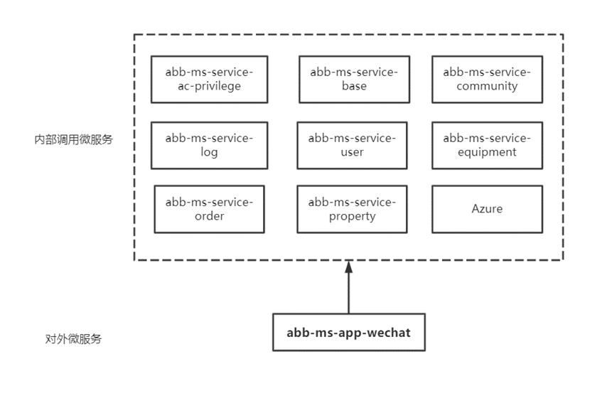

[toc]

## 1、abb-ms-app-wechat整体介绍：

- abb-ms-app-wechat是为微信小程序提供的后台服务。在后期交付的用户APP中也会使用到。
- 其主要调用到的微服务模块如图2所示。
- 微信小程序后台目前主要有10个功能模块，每个模块调用其他微服务以及微服务中具体的接口如图2所示。
- 其中各个模块对应的负责人如图3所示。

​                                                          图1：微信小程序后台调用的微服务

​											图2：微信小程序各模块与其他微服务的调用关系

​											图3：微信小程序调用其他微服务模块对应负责人

## 2、微信小程序整体功能介绍

## 3、 各模块详细介绍

---

### AcControl——门禁模块

​	门禁模块是其中最重要的一个模块，主要负责钥匙的申请、审批等功能

结合实际业务进行介绍：

1. 用户钥匙申请

2. 户主对其房间下的住户进行管理
3. 户主邀请他人成为房间住户
4. 邀请访客功能

整体介绍：

- 门禁控制主要有户主和住户两种角色，户主能够查看其房间列表、住户列表、以及对住户进行管理；
- 根据用户在小区的住户信息查看有开门权限的门禁，其中门禁具有有效期；
- 用户可以申请访客密码，但最多申请3个，能够对访客密码进行列表查看以及删除；
- 其中户主对用户进行邀请以及管理；
- 普通用户可以申请钥匙，户主对钥匙申请进行审核；
- 用户和户主可以查看门禁房间管理列表，户主可以查看房间的住户列表以及房间列表，并且删除非户主的住户的钥匙。

**1、用户钥匙申请**

- 用户申请成为某个房间的住户或者户主，其中成为住户的申请可以由该房间的户主或后台管理员审核，审核结果在通知栏中的申请结果中显示，也可以在钥匙申请中显示出来。

  

  ​																		用户钥匙申请成为户主

  

  ​																	后台对用户申请进行审核，成为住户或者户主

  

  ​                                           户主对用户进行钥匙审核，每个房间只有一个户主

**2、户主对其房间下的住户进行管理**

**3、户主邀请他人成为房间住户**

邀请人接收邀请，获取钥匙权限

**4、邀请访客功能**

- 住户和户主都可以邀请访客
- 单个房间单个住户访客邀请码最多只能生成3个

---

###  communityControl——小区模块

- 小区模块对应的微服务如下

- 用户可以查询自己具有开门权限的小区以及房间号
- 用户查询小区列表、小区结构、以及单元房间列表，并且能够通过小区增值服务列表，查看用户是否本小区

---

### ConfigControl——配置模块

- 配置模块对应的微服务如下

- 其中banner中的图片存储在Azure Blob当中，每次从中拿去URL地址读取图片
- 列出所有具有小区的城市，以及本地所在的城市

---

### VideoPassControl——视频通模块

- 配置模块对应的微服务如下

- 视频通主要是提供用户购买视频通话权限的功能；
- 用户和户主可以查看自己的订单列表，户主可以查看自己的房间列表；
- 用户和户主提交用户购买的订单，目前还没有相应的支付功能。

---

### FacePassControl——人脸通模块

- 配置模块对应的微服务如下1

- 用户查取在某个小区中能够查看用其人脸开门的所有设备列表，以及订单信息；
- 户主查看在某个小区中的住户列表；
- 用户和户主提交用户购买的订单，目前还没有相应的支付功能。

---

### ComplaintControl——投诉模块

- 投诉模块对应的微服务如下

- 用户可以在具备该小区权限的前提下发起投诉
- 能够显示用户的投诉记录，以及根据投诉ID获取单条投诉的详细信息

---

### LogControl——日志模块

- 用户通过`选择房间ID`、`开门类型`和`期限`来返回对应的开门记录列表。其中`偏移量`表示返回数据的开始位置，`数据量`表示每次返回的记录条数。

---

### UserControl——用户模块

- 主要包括三种用户信息，用户模块主要是对这些的查询和修改：

  - 用户基础信息：用户`头像`、`昵称`和`手机号`，包括用户基础信息的获取与修改

  

  - 用户身份信息：包括用户身份信息的获取与修改

  

  - 用户身份授权信息：查看用户授权的小区列表，以及用户是否具有某小区的权限。

---

### NoticeControl——通知模块

- 在小程序的首页中，会显示小区中最新的一条公告信息，点击之后能够查看小区所有的通知信息
- 具有小区权限的用户能够查看到私信列表
- 用户能够查看到钥匙申请结果和钥匙邀请结果
- **消息红点提示**

---

### RepairControl——报修模块

- **发起保修**由接口**/api/v1/repair/launch**来完成，其中保修图片由接口**/api/v1/repair/picture**来进行上传
- **报修记录查看**由接口**/api/v1/repair/list**来实现，由接口**/api/v1/repair/detail/{id}**来查看报修ID的具体信息

## 4、相关问题总结

1. 照片上传

   在wechat后台中，有三个接口用于图片上传

   - /api/v1/repair/picture：上传报修照片
   - /api/v1/user/face-pic：人脸识别照片采集
   - /api/v1/complain/picture：上传投诉照片

   将照片保存到Azure blob当中，在业务模块中保存图片对应的URL。

2. 识别出的问题

   - 在视频和人脸业务中需要用户进行业务的开通，目前还没有相应的支付功能

   - 微信小程序没有门禁相应的接口，不能实现远程门禁开门操作

   - 在人脸识别照片采集中/api/v1/user/face-pic，没有对人脸照片进行检测，目前所有图片都可以进行上传